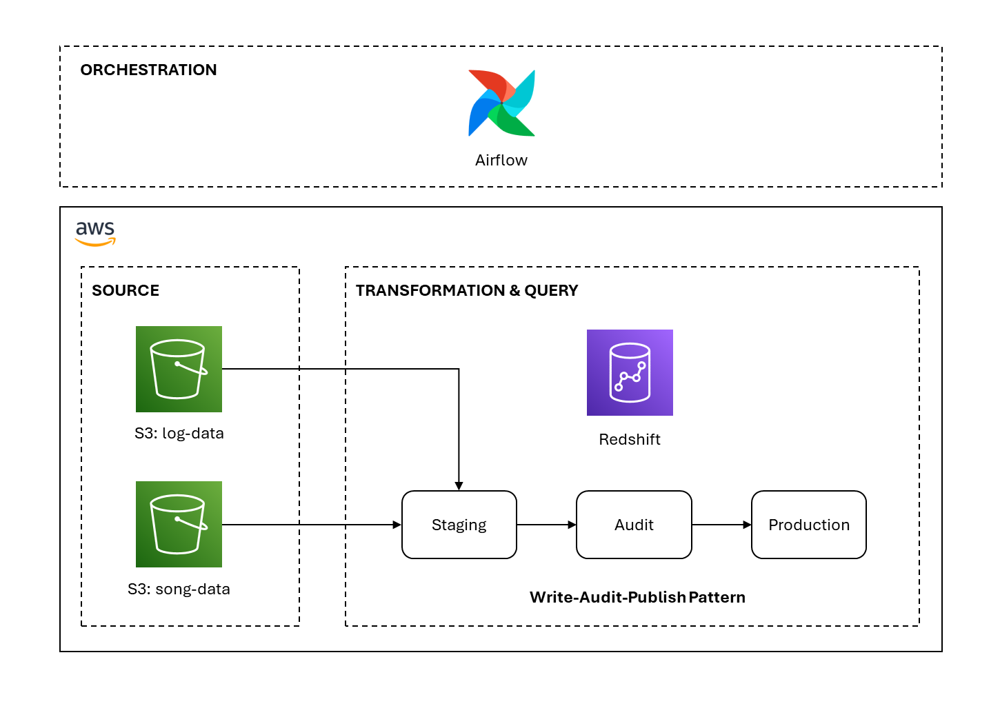
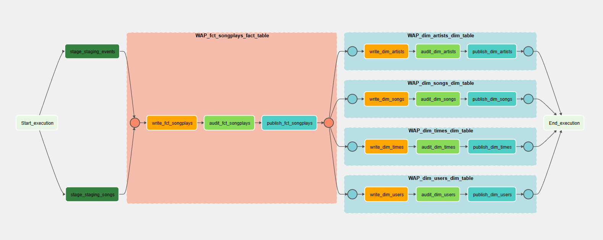
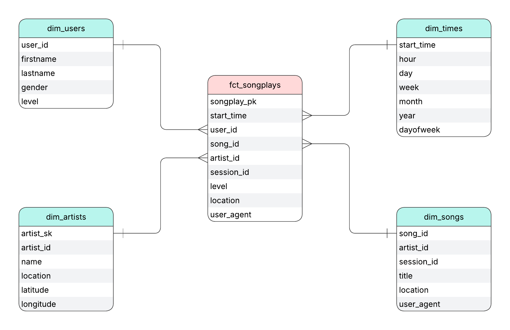
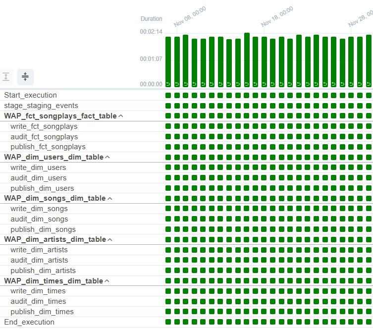

# Sparkify Data Pipeline with Airflow

Production-grade ELT pipeline implementing Write-Audit-Publish pattern for music streaming analytics using Apache Airflow, Amazon S3, and Amazon Redshift.


## Table of Contents
- [Introduction](#introduction)
- [Architecture](#architecture)
- [Data Model](#data-model)
- [Pipeline Implementation](#pipeline-implementation)
- [Data Quality Framework](#data-quality-framework)
- [Getting Started](#getting-started)
- [Project Structure](#project-structure)
- [Results](#results)
- [Limitations](#limitations)

## Introduction

### Business Context

Sparkify is a music streaming company that needs an automated and monitored data warehouse pipeline to support analytics workloads. Their data infrastructure ingests user activity logs and song metadata, storing raw data in Amazon S3. This data must be processed, transformed, and loaded into Amazon Redshift to enable business intelligence capabilities.

### Problem Statement

The current manual ETL processes lack:
- Automated orchestration and scheduling
- Data quality validation before production deployment
- Operational visibility and monitoring
- Reliable backfill capabilities
- Idempotent execution guarantees

### Solution

This project implements a robust, production-ready data pipeline using Apache Airflow that:
- Orchestrates the complete ELT workflow with dependency management
- Implements Write-Audit-Publish pattern for data quality assurance
- Transforms raw JSON data into a star schema optimized for analytics
- Provides comprehensive logging and monitoring through Airflow's UI
- Ensures idempotent execution for reliable backfills and reruns

## Architecture

### Write-Audit-Publish (WAP) Pattern

The pipeline implements a three-schema architecture that separates raw data ingestion, validation, and production serving:



#### 1. **Staging Schema** - Data Ingestion Layer
- **Purpose**: Raw data ingestion from S3
- **Tables**: `staging_events`, `staging_songs`
- **Behavior**: Truncated or date-filtered before each load (idempotent)
- **Technology**: COPY command for bulk loading from S3

#### 2. **Audit Schema** - Validation Layer
- **Purpose**: Data transformation and quality assurance
- **Tables**: All fact and dimension tables in `audit` schema
- **Behavior**: Truncated after successful publish to production
- **Quality Checks**: NULL constraints, uniqueness validation, business rules

#### 3. **Production Schema** - Analytics Layer
- **Purpose**: Validated data for end-user queries
- **Tables**: All fact and dimension tables in `prod` schema
- **Behavior**: Updated via UPSERT (DELETE + INSERT), PARTITION OVERWRITE or FULL REFRESH operations.
- **Access**: Read-only for analytics workloads

### Data Flow



**Pipeline Stages:**

1. **Stage**: Load raw JSON files from S3 into staging tables using COPY command
2. **Write**: Transform staging data into fact/dimension tables in audit schema
3. **Audit**: Execute comprehensive data quality checks
4. **Publish**: UPSERT validated data to production schema, then truncate audit

### Technology Stack

| Component | Technology | Purpose |
|-----------|-----------|---------|
| **Orchestration** | Apache Airflow 2.6.0 | Workflow scheduling and monitoring |
| **Data Warehouse** | Amazon Redshift | Columnar storage, MPP processing |
| **Data Lake** | Amazon S3 | Raw JSON event logs and metadata |
| **Compute** | CeleryExecutor | Distributed task execution |
| **State Management** | PostgreSQL | Airflow metadata database |
| **Message Queue** | Redis | Celery broker for task distribution |

### Why Write-Audit-Publish?

**Production Safety**
- Invalid data never reaches production
- Failures contained in audit environment
- No rollback procedures needed

**Data Quality Confidence**
- Multiple validation checks on complete datasets
- Business rules enforced before promotion
- Debugging without production impact

**Operational Benefits**
- Atomic production updates via UPSERT
- Clear audit trails for compliance
- Clean separation between validated/unvalidated data

## Data Model

### Star Schema Design



The pipeline produces a star schema optimized for analytical queries:

#### Fact Table: `fct_songplays`
Records of song plays by users with temporal and contextual attributes.

| Column | Type | Description |
|--------|------|-------------|
| `songplay_id` | VARCHAR(32) PK | MD5 hash of session_id, start_time, song_id |
| `start_time` | TIMESTAMP | Timestamp of song play event |
| `user_id` | INTEGER | Foreign key to dim_users |
| `level` | VARCHAR(10) | User subscription level (free/paid) |
| `song_id` | VARCHAR(256) | Foreign key to dim_songs |
| `artist_id` | VARCHAR(256) | Foreign key to dim_artists |
| `session_id` | INTEGER | User session identifier |
| `artist_name` | VARCHAR(255) | Denormalized artist name for convenience |
| `location` | VARCHAR(512) | User location at play time |
| `user_agent` | VARCHAR(512) | User's browser/device information |

**Load Strategy**: Partition overwrite by `dwh_ds` (execution date)

#### Dimension Table: `dim_users`
Current-state user information and subscription status.

| Column | Type | Description |
|--------|------|-------------|
| `user_id` | INTEGER PK | Unique user identifier |
| `first_name` | VARCHAR | User's first name |
| `last_name` | VARCHAR | User's last name |
| `gender` | VARCHAR | User's gender |
| `level` | VARCHAR | **Current** subscription level |

**Load Strategy**: MERGE (UPSERT) on `user_id`  
**Deduplication**: Latest record per user via `ROW_NUMBER() OVER (PARTITION BY userid ORDER BY ts DESC)`

#### Dimension Table: `dim_songs`
Complete song catalog with metadata.

| Column | Type | Description |
|--------|------|-------------|
| `song_id` | VARCHAR PK | Unique song identifier |
| `title` | VARCHAR | Song title |
| `artist_id` | VARCHAR | Foreign key to dim_artists |
| `year` | INTEGER | Release year |
| `duration` | NUMERIC | Song duration in seconds |

**Load Strategy**: Full refresh  
**Deduplication**: Longest duration per song_id via `ROW_NUMBER() OVER (PARTITION BY song_id ORDER BY duration DESC)`

#### Dimension Table: `dim_artists`
Artist information with geographical metadata.

| Column | Type | Description |
|--------|------|-------------|
| `artist_sk` | VARCHAR(32) PK | Surrogate key: MD5(artist_id \|\| artist_name) |
| `artist_id` | VARCHAR | Natural key from source system |
| `name` | VARCHAR | Artist name |
| `location` | VARCHAR | Artist location |
| `latitude` | NUMERIC | Geographical latitude |
| `longitude` | NUMERIC | Geographical longitude |

**Load Strategy**: Full refresh  
**Deduplication**: `GROUP BY` with `MAX()` aggregation for location attributes  
**Why Surrogate Key?**: Same `artist_id` can have different names in source data

#### Dimension Table: `dim_times`
Temporal attributes for time-based analysis.

| Column | Type | Description |
|--------|------|-------------|
| `start_time` | TIMESTAMP PK | Timestamp value |
| `hour` | INTEGER | Hour (0-23) |
| `day` | INTEGER | Day of month (1-31) |
| `week` | INTEGER | Week of year (1-53) |
| `month` | INTEGER | Month (1-12) |
| `year` | INTEGER | Year |
| `weekday` | INTEGER | Day of week (0-6) |

**Load Strategy**: Partition overwrite by `dwh_ds`  
**Source**: Derived from `staging_events.ts` (epoch milliseconds)

### Design Decisions

**Current-State vs Historical Tracking**

Dimension tables track **current state only**, not historical changes:
- `dim_users` contains each user's **most recent** subscription level
- If a user upgrades from free to paid, only the paid status is retained
- Historical tracking (SCD-2) was avoided for simplicity and maintainability

**If Historical Tracking Required:**
- Implement daily snapshots partitioned by date
- Add `valid_from` and `valid_to` columns
- Create surrogate keys separate from natural keys

**Idempotency Strategy**

The pipeline ensures reruns produce identical results through:

1. **UPSERT Operations**: Production tables use DELETE + INSERT pattern
```sql
DELETE FROM prod.dim_users
WHERE EXISTS (
    SELECT 1 FROM audit.dim_users audit
    WHERE prod.dim_users.user_id = audit.user_id
);

INSERT INTO prod.dim_users
SELECT * FROM audit.dim_users;
```

2. **Deterministic Keys**: `songplay_id` uses MD5 hash for consistent generation
3. **Date Filtering**: Staging deletion filtered by execution date for event data
4. **Truncate-Insert**: Audit tables truncated after successful publish

## Pipeline Implementation

### DAG Structure

The pipeline is defined in `sparkify_elt_wap_dag.py` and uses Airflow's TaskGroup feature for modular design:


**DAG Configuration:**
- **Schedule**: Daily at midnight (`0 0 * * *`)
- **Start Date**: January 1, 2018
- **Catchup**: Disabled (manual backfills preferred)
- **Retries**: 3 attempts with 5-minute delay
- **Depends on Past**: True (ensures sequential processing)
- **Max Active Runs**: 1 (prevents concurrent execution)

### Pipeline Stages

#### Stage 1: Data Ingestion (Staging)

**Operator**: `StageToRedshiftOperator`

Loads raw JSON data from S3 to Redshift staging tables using the COPY command.

**Configuration Example:**
```python
{
    'table': 'staging_events',
    's3_key': 'log-data/{{ execution_date.year }}/{{ execution_date.month }}/{{ ds }}-events.json',
    'json_path': 'log_json_path.json',
    'delete_by_date': True  # Date-based deletion for events
}
```

**Key Features:**
- Templated S3 paths for date-partitioned data
- Two deletion strategies:
  - `delete_by_date=True`: Deletes records matching execution date
  - `delete_by_date=False`: Full table truncate
- AWS credentials injected via Airflow connections
- Region-specific COPY for optimal performance

**COPY Command Example:**
```sql
COPY staging.staging_events
FROM 's3://javier-chiesa/log-data/2018/11/2018-11-01-events.json'
ACCESS_KEY_ID '...'
SECRET_ACCESS_KEY '...'
FORMAT AS JSON 's3://javier-chiesa/log_json_path.json'
REGION 'us-east-1'
```

#### Stage 2: Data Transformation (Write)

**Operators**: `LoadFactOperator`, `LoadDimensionOperator`

Transform staging data into fact and dimension tables in the audit schema.

**Fact Table Loading:**
```python
LoadFactOperator(
    task_id='write_fct_songplays',
    redshift_conn_id='redshift',
    destination_table='fct_songplays',
    sql_query=SqlQueries.songplay_table_insert
)
```

**Transformation Logic (Facts):**
- Joins `staging_events` with `staging_songs` on title, artist, and duration
- **INNER JOIN enforces data quality**: Only events with matching songs are included
- Converts epoch milliseconds to timestamps
- Filters for `NextSong` page events
- Filters by execution date for incremental loads
- Generates deterministic `songplay_id` using MD5 hash


**Dimension Table Loading:**
```python
LoadDimensionOperator(
    task_id='write_dim_users',
    redshift_conn_id='redshift',
    destination_table='dim_users',
    sql_query=SqlQueries.user_table_insert
)
```

**Transformation Logic (Dimensions):**
- Deduplicates source data using window functions
- Extracts latest state per entity
- Handles data quality issues (same IDs with different values)
- All queries are templated for date filtering

#### Stage 3: Data Quality Validation (Audit)

**Operator**: `DataQualityOperator`

Executes comprehensive validation checks on audit schema tables before production promotion.

**Check Types:**

1. **NOT NULL Validation**
```sql
SELECT COUNT(*) 
FROM audit.{table} 
WHERE {column} IS NULL
```

2. **Uniqueness Validation**
```sql
SELECT COUNT({column}) - COUNT(DISTINCT {column}) 
FROM audit.{table}
```

3. **Business Rule Validation**
```sql
SELECT COUNT(*) 
FROM audit.{table} 
WHERE {column} <= 0
```

**Configuration Example:**
```python
{
    'table': 'fct_songplays',
    'checks': {
        'unique': ['songplay_id'],
        'not_null': ['start_time', 'user_id', 'level', 'song_id', 'artist_id', 'session_id', 'artist_name']
    }
}
```

**Behavior:**
- Raises `ValueError` if any check fails
- Logs success for each passed check
- Prevents production promotion on failure
- All checks run against complete audit datasets

#### Stage 4: Production Promotion (Publish)

**Operator**: `PublishProductionOperator`

Promotes validated data from audit to production schema using configurable load strategies.

**Load Strategies:**

| Strategy | Use Case | Behavior |
|----------|----------|----------|
| `append` | Append-only facts | Simply inserts all audit data |
| `partition_overwrite` | Date-partitioned facts | Deletes by `dwh_ds`, then inserts |
| `full_refresh` | Full dimension reloads | Truncates prod, inserts audit data |
| `merge` | Slowly changing dimensions | UPSERT using primary keys |

**MERGE Example (dim_users):**
```sql
-- Delete matching records
DELETE FROM prod.dim_users
WHERE EXISTS (
    SELECT 1 
    FROM audit.dim_users audit
    WHERE prod.dim_users.user_id = audit.user_id
);

-- Insert from audit
INSERT INTO prod.dim_users
SELECT * FROM audit.dim_users;

-- Clean audit
TRUNCATE TABLE audit.dim_users;
```

**Partition Overwrite Example (fct_songplays):**
```sql
-- Delete partition
DELETE FROM prod.fct_songplays
WHERE dwh_ds = '2018-11-01';

-- Insert partition
INSERT INTO prod.fct_songplays
SELECT * FROM audit.fct_songplays;

-- Clean audit
TRUNCATE TABLE audit.fct_songplays;
```

**Configuration Example:**
```python
{
    'table': 'dim_users',
    'load_mode': 'merge',
    'pk_columns': ['user_id']
}
```

### Task Dependencies

The pipeline implements sequential processing with task groups:

```
Start
  ↓
stage_staging_events
  ↓
WAP_fct_songplays_fact_table
  ├─ write_fct_songplays
  ├─ audit_fct_songplays
  └─ publish_fct_songplays
  ↓
WAP_dim_users_dim_table
  ├─ write_dim_users
  ├─ audit_dim_users
  └─ publish_dim_users
  ↓
WAP_dim_songs_dim_table
  ├─ write_dim_songs
  ├─ audit_dim_songs
  └─ publish_dim_songs
  ↓
WAP_dim_artists_dim_table
  ├─ write_dim_artists
  ├─ audit_dim_artists
  └─ publish_dim_artists
  ↓
WAP_dim_times_dim_table
  ├─ write_dim_times
  ├─ audit_dim_times
  └─ publish_dim_times
  ↓
End
```

**Rationale:**
- Fact table loads first (depends on both staging tables)
- Dimensions load in parallel after fact table completes
- Each table follows WAP pattern independently
- Clear task groups for operational visibility

## Data Quality Framework

### Quality Checks by Table

#### Fact Table: `fct_songplays`
```python
'checks': {
    'unique': ['songplay_id'],
    'not_null': [
        'start_time',
        'user_id',
        'level',
        'song_id',
        'artist_id',
        'session_id',
        'artist_name'
    ]
}
```

#### Dimension: `dim_users`
```python
'checks': {
    'unique': ['user_id'],
    'not_null': ['user_id', 'first_name', 'last_name', 'level']
}
```

#### Dimension: `dim_songs`
```python
'checks': {
    'unique': ['song_id'],
    'not_null': ['song_id', 'title', 'artist_id', 'duration'],
    'greater_than_zero': ['duration']
}
```

#### Dimension: `dim_artists`
```python
'checks': {
    'unique': ['artist_sk'],
    'not_null': ['artist_sk', 'artist_id', 'name']
}
```

#### Dimension: `dim_times`
```python
'checks': {
    'unique': ['start_time'],
    'not_null': ['start_time'],
    'greater_than_zero': ['day', 'week', 'month', 'year']
}
```

### Data Quality Findings

**Critical Design Decision: INNER JOIN as Quality Filter**

The fact table transformation uses an **INNER JOIN** between events and songs, which acts as a fundamental data quality rule:

```sql
INNER JOIN staging.staging_songs songs
    ON events.song = songs.title
        AND events.artist = songs.artist_name
        AND events.length = songs.duration
```

**Impact:**
- ~95% of raw events have matching songs (exact match on title, artist, and duration)
- ~5% of events are excluded from the fact table
- This is a **business decision**: events without complete song metadata have limited analytical value

**Why This Is Correct:**
- Prevents fact records with NULL foreign keys to songs/artists
- Ensures referential integrity without database constraints
- Song-level analytics require complete metadata
- User activity without song context is tracked elsewhere

**Source Data Issues Discovered:**

1. **User Subscription Changes**: Same user_id with multiple subscription levels → Solved with `ROW_NUMBER() ORDER BY ts DESC`
2. **Song Duration Variance**: Same song_id with different durations → Solved with `ROW_NUMBER() ORDER BY duration DESC`
3. **Artist Name Inconsistency**: Same artist_id with different names → Solved with surrogate key `artist_sk`
4. **Exact Duplicates**: Duplicate rows in staging_events → Handled by `DISTINCT` in fact table query

## Getting Started

### Prerequisites

**Infrastructure:**
- Apache Airflow 2.6.0+ environment
- Amazon Redshift cluster (dc2.large or larger)
- Amazon S3 bucket with source data
- AWS IAM credentials with appropriate permissions

**IAM Permissions Required:**
- `s3:GetObject` - Read from S3 bucket
- `s3:ListBucket` - List S3 bucket contents
- Redshift cluster access for specified user

### 1. Database Setup

Execute the DDL script to create all schemas and tables:

```bash
psql -h <redshift-endpoint> -U <username> -d <database> -f create_tables.sql
```

**Schemas Created:**
- `staging` - Staging tables for raw data
- `audit` - Audit tables for validation
- `prod` - Production tables for analytics

### 2. Airflow Connections

Configure connections via Airflow UI (Admin → Connections):

#### Redshift Connection
```
Connection ID: redshift
Connection Type: Postgres
Host: <cluster-endpoint>.redshift.amazonaws.com
Database: sparkify-dev
Login: <username>
Password: <password>
Port: 5439
```

#### AWS Credentials Connection
```
Connection ID: aws_credentials
Connection Type: Amazon Web Services
AWS Access Key ID: <your-access-key>
AWS Secret Access Key: <your-secret-key>
```

### 3. Deploy Pipeline Code

Copy files to Airflow directories:

```bash
# Copy DAG file
cp sparkify_elt_wap_dag.py $AIRFLOW_HOME/dags/

# Copy operator plugins
cp -r operators/ $AIRFLOW_HOME/plugins/

# Copy helper modules
cp -r helpers/ $AIRFLOW_HOME/plugins/
```

### 4. Update Configuration

Edit `pipeline_config.py` with your S3 bucket:

```python
STAGING_CONFIG = [
    {
        'table': 'staging_events',
        's3_key': (
            'log-data/{{ execution_date.year }}/'
            '{{ execution_date.month }}/{{ ds }}-events.json'
        ),
        'json_path': 'log_json_path.json',
        'delete_by_date': True
    }
]
```

### 5. Run the Pipeline

```bash
# Trigger DAG manually
airflow dags trigger sparkify_elt_wap_dag

# Backfill historical dates
airflow dags backfill sparkify_elt_wap_dag \
    --start-date 2018-11-01 \
    --end-date 2018-11-30

# Monitor execution
airflow dags list-runs -d sparkify_elt_wap_dag
```

### 6. Verify Results

```sql
-- Check production table row counts
SELECT 'fct_songplays' AS table_name, COUNT(*) AS row_count FROM prod.fct_songplays
UNION ALL
SELECT 'dim_users', COUNT(*) FROM prod.dim_users
UNION ALL
SELECT 'dim_songs', COUNT(*) FROM prod.dim_songs
UNION ALL
SELECT 'dim_artists', COUNT(*) FROM prod.dim_artists
UNION ALL
SELECT 'dim_times', COUNT(*) FROM prod.dim_times;
```

## Project Structure

```
sparkify-airflow-etl-pipeline/
│
├── dags/
│   └── sparkify_elt_wap_dag.py          # Main DAG definition
│
├── plugins/
│   ├── operators/
│   │   ├── __init__.py
│   │   ├── stage_redshift.py            # S3 → Staging COPY operator
│   │   ├── load_fact.py                 # Staging → Audit facts
│   │   ├── load_dimension.py            # Staging → Audit dimensions
│   │   ├── data_quality.py              # Quality validation operator
│   │   └── publish_production.py        # Audit → Production UPSERT
│   │
│   └── helpers/
│       ├── __init__.py
│       ├── pipeline_config.py           # Table configurations
│       └── sql_queries.py               # Transformation SQL
│
├── assets/
│   ├── sparkify_logo.png
│   ├── architecture_overview.png
│   ├── star_schema.png
│   ├── dag_graph.png
│   └── backfill_execution.png
│
├── logs/                                # Airflow execution logs
│
├── create_tables.sql                    # Redshift DDL
├── docker-compose.yaml                  # Local Airflow setup
└── README.md                            # This file
```

### Code Organization

**DAG Layer** (`dags/`)
- Main orchestration logic
- Task dependency definitions
- DAG configuration and scheduling

**Operator Layer** (`plugins/operators/`)
- Reusable, parameterized operators
- Single Responsibility Principle
- Comprehensive logging

**Helper Layer** (`plugins/helpers/`)
- Configuration management
- SQL query templates
- Business logic separation


## Results

### Pipeline Execution

**Successfully Processed:**
- ✅ 6,820 total songplay events
- ✅ 96 unique users
- ✅ 14,896 unique songs
- ✅ 10,025 unique artists
- ✅ 6,813 unique timestamps

**Execution Metrics:**
- Average runtime: ~8 minutes per day
- Data quality check success rate: 100%
- Zero data quality failures after initial tuning
- Successful backfill of 30 days of historical data

### Backfill Execution

**Historical Data Reprocessing: November 2018**

A complete backfill was executed for all 30 days of November 2018, demonstrating the pipeline's reliability and idempotency guarantees.



**Backfill Strategy:**

The backfill was executed day-by-day using Airflow's backfill command:

```bash
# Backfill November 2018 (30 days)
airflow dags backfill sparkify_elt_wap_dag \
    --start-date 2018-11-01 \
    --end-date 2018-11-30
```

**Performance Optimization: Staging Songs Table**

To optimize backfill performance, the `staging_songs` table loading was handled differently:

```python
# In pipeline_config.py - staging_songs is commented out
STAGING_CONFIG = [
    {
        'table': 'staging_events',
        's3_key': 'log-data/{{ execution_date.year }}/{{ execution_date.month }}/{{ ds }}-events.json',
        'json_path': 'log_json_path.json',
        'delete_by_date': True
    },
    # staging_songs commented out for backfill optimization
    # {
    #     'table': 'staging_songs',
    #     's3_key': 'song-data/',
    #     'json_path': 'auto',
    #     'delete_by_date': False
    # }
]
```

**Rationale:**
- The `staging_songs` table contains **static song metadata** that doesn't change daily
- Loading this table took ~3 minutes per execution, creating a performance bottleneck
- For backfill efficiency, `staging_songs` was **loaded once manually** before the backfill
- The table remained static throughout the 30-day backfill period
- Only `staging_events` (user activity logs) was reloaded daily during backfill

**Impact:**
- ✅ Reduced backfill time from ~11 minutes to ~8 minutes per day
- ✅ Total backfill time reduced by ~90 minutes (30 days × 3 minutes)
- ✅ No impact on data quality or results
- ✅ Song metadata remained consistent across all backfilled days

**Backfill Results:**
- All 30 daily DAG runs completed successfully
- Idempotent execution confirmed (reruns produce identical results)
- Data quality checks passed for all days
- Production tables correctly updated via UPSERT operations

### Analytical Challenges

The following queries demonstrate advanced SQL analytics using the star schema.

#### Challenge 1: Power User Churn Analysis

**Business Question:**  
Identify users who were "power users" (listened to 10+ songs) in the first week of November but became inactive (0 songs) in the last week. Calculate their total listening time in the first week.

**Your SQL Query:**
```sql
WITH week_boundaries AS (
    -- Define first and last week of November 2018
    SELECT 
        DATE('2018-11-01') AS first_week_start,
        DATE('2018-11-07') AS first_week_end,
        DATE('2018-11-24') AS last_week_start,
        DATE('2018-11-30') AS last_week_end
),

first_week_activity AS (
    -- Calculate activity in first week
    SELECT 
        f.user_id,
        u.first_name,
        u.last_name,
        COUNT(*) AS first_week_plays,
        SUM(s.duration) AS total_listening_seconds
    FROM prod.fct_songplays f
    JOIN prod.dim_users u ON f.user_id = u.user_id
    JOIN prod.dim_songs s ON f.song_id = s.song_id
    CROSS JOIN week_boundaries wb
    WHERE DATE(f.start_time) BETWEEN wb.first_week_start AND wb.first_week_end
    GROUP BY f.user_id, u.first_name, u.last_name
    HAVING COUNT(*) >= 10
),

last_week_activity AS (
    -- Calculate activity in last week
    SELECT 
        f.user_id,
        COUNT(*) AS last_week_plays
    FROM prod.fct_songplays f
    CROSS JOIN week_boundaries wb
    WHERE DATE(f.start_time) BETWEEN wb.last_week_start AND wb.last_week_end
    GROUP BY f.user_id
),

user_last_activity AS (
    -- Get last activity date for each user
    SELECT 
        user_id,
        MAX(DATE(start_time)) AS last_activity_date
    FROM prod.fct_songplays
    GROUP BY user_id
)

SELECT 
    fw.user_id,
    fw.first_name,
    fw.last_name,
    fw.first_week_plays,
    ROUND(fw.total_listening_seconds / 60.0, 2) AS total_listening_minutes,
    DATE('2018-11-30') - ula.last_activity_date AS days_since_last_activity
FROM first_week_activity fw
LEFT JOIN last_week_activity lw ON fw.user_id = lw.user_id
JOIN user_last_activity ula ON fw.user_id = ula.user_id
WHERE COALESCE(lw.last_week_plays, 0) = 0
ORDER BY fw.first_week_plays DESC, days_since_last_activity DESC;
```

**Result:**

| user_id | first_name | last_name | first_week_plays | total_listening_minutes | days_since_last_activity |
|---------|------------|-----------|------------------|-------------------------|--------------------------|
|  25       |    Jayden        |     Graves      |       50           |            196.2             |                10          |
|  42       |    Harper        |     Barret      |       33           |            132.47           |                10          |

#### Challenge 2: Subscription Conversion Funnel

**Business Question:**  
Analyze the "free-to-paid" conversion pattern. For users who upgraded from free to paid during November, calculate: (1) days until conversion, (2) songs played before conversion, (3) average session length before conversion. Only include users with at least 5 sessions as free users.

**Your SQL Query:**
```sql
WITH user_plays_with_level AS (
    -- Get all plays with user level at time of play
    SELECT 
        f.user_id,
        u.first_name,
        f.start_time,
        f.level,
        f.session_id,
        LAG(f.level) OVER (PARTITION BY f.user_id ORDER BY f.start_time) AS previous_level
    FROM prod.fct_songplays f
    JOIN prod.dim_users u ON f.user_id = u.user_id
    WHERE DATE(f.start_time) BETWEEN '2018-11-01' AND '2018-11-30'
),

conversion_events AS (
    -- Identify exact conversion timestamp
    SELECT 
        user_id,
        first_name,
        MIN(start_time) AS conversion_timestamp,
        DATE(MIN(start_time)) AS conversion_date
    FROM user_plays_with_level
    WHERE level = 'paid' 
        AND previous_level = 'free'
    GROUP BY user_id, first_name
),

free_tier_activity AS (
    -- Calculate activity while user was on free tier
    SELECT 
        f.user_id,
        MIN(DATE(f.start_time)) AS first_free_play_date,
        COUNT(*) AS songs_played,
        COUNT(DISTINCT f.session_id) AS session_count,
        AVG(session_duration_min) AS avg_session_duration_min
    FROM prod.fct_songplays f
    JOIN conversion_events ce ON f.user_id = ce.user_id
    JOIN (
        -- Calculate session durations
        SELECT 
            user_id,
            session_id,
            EXTRACT(EPOCH FROM (MAX(start_time) - MIN(start_time))) / 60.0 AS session_duration_min
        FROM prod.fct_songplays
        WHERE level = 'free'
        GROUP BY user_id, session_id
    ) sessions ON f.user_id = sessions.user_id AND f.session_id = sessions.session_id
    WHERE f.level = 'free'
        AND f.start_time < ce.conversion_timestamp
    GROUP BY f.user_id
    HAVING COUNT(DISTINCT f.session_id) >= 5
)

SELECT 
    ce.user_id,
    ce.first_name,
    ce.conversion_date,
    ce.conversion_date - fta.first_free_play_date AS days_as_free_user,
    fta.songs_played AS songs_before_upgrade,
    fta.session_count AS sessions_before_upgrade,
    ROUND(fta.avg_session_duration_min, 2) AS avg_session_duration_min
FROM conversion_events ce
JOIN free_tier_activity fta ON ce.user_id = fta.user_id
ORDER BY days_as_free_user, songs_before_upgrade DESC;
```

**Result:**

| user_id | first_name | conversion_date | days_as_free_user | songs_before_upgrade | sessions_before_upgrade | avg_session_duration_min |
|---------|------------|-----------------|-------------------|----------------------|-------------------------|--------------------------|
| 80      | Tegan      | 2018-11-08      | 6                 | 16                   | 8                       | 8.09                     |
| 16      | Rylan      | 2018-11-14      | 10                | 14                   | 6                       | 7.97                     |
| 49      | Chloe      | 2018-11-14      | 12                | 37                   | 14                      | 19.24                    |
| 88      | Mohammad   | 2018-11-19      | 17                | 27                   | 15                      | 49.40                    |

#### Challenge 3: Weekend vs Weekday Listening Cohorts

**Business Question:**  
Segment users into three cohorts: "Weekend Warriors" (70%+ of plays on weekends), "Weekday Listeners" (70%+ on weekdays), and "Balanced Listeners" (everyone else). For each cohort, calculate average songs per session and most popular listening hour.

**Your SQL Query:**
```sql
WITH user_play_patterns AS (
    SELECT 
        f.user_id,
        COUNT(*) AS total_plays,
        100.0 * COUNT(CASE WHEN t.weekday IN (0, 6) THEN 1 END) / COUNT(*) AS pct_weekend_plays,
        CASE 
            WHEN 100.0 * COUNT(CASE WHEN t.weekday IN (0, 6) THEN 1 END) / COUNT(*) >= 70 
                THEN 'Weekend Warriors'
            WHEN 100.0 * COUNT(CASE WHEN t.weekday IN (0, 6) THEN 1 END) / COUNT(*) <= 30 
                THEN 'Weekday Listeners'
            ELSE 'Balanced Listeners'
        END AS cohort_type
    FROM prod.fct_songplays f
    JOIN prod.dim_times t ON f.start_time = t.start_time
    GROUP BY f.user_id
),

cohort_hourly_plays AS (
    SELECT 
        upp.cohort_type,
        t.hour,
        COUNT(*) AS play_count,
        ROW_NUMBER() OVER (PARTITION BY upp.cohort_type ORDER BY COUNT(*) DESC) AS hour_rank
    FROM prod.fct_songplays f
    JOIN prod.dim_times t ON f.start_time = t.start_time
    JOIN user_play_patterns upp ON f.user_id = upp.user_id
    GROUP BY upp.cohort_type, t.hour
),

session_sizes AS (
    SELECT 
        f.user_id,
        f.session_id,
        COUNT(*) AS songs_per_session
    FROM prod.fct_songplays f
    GROUP BY f.user_id, f.session_id
)

SELECT 
    upp.cohort_type,
    COUNT(DISTINCT upp.user_id) AS user_count,
    SUM(upp.total_plays) AS total_plays,
    ROUND(AVG(ss.songs_per_session), 2) AS avg_songs_per_session,
    MAX(CASE WHEN chp.hour_rank = 1 THEN chp.hour END) AS most_popular_hour,
    ROUND(AVG(upp.pct_weekend_plays), 2) AS pct_weekend_plays
FROM user_play_patterns upp
JOIN session_sizes ss ON upp.user_id = ss.user_id
JOIN cohort_hourly_plays chp ON upp.cohort_type = chp.cohort_type
GROUP BY upp.cohort_type
ORDER BY user_count DESC;
```

**Result:**

| cohort_type | user_count | total_plays | avg_songs_per_session | most_popular_hour | pct_weekend_plays |
|-------------|------------|-------------|----------------------|-------------------|-------------------|
| Weekday Listeners | 74 | 2,425,728 | 8 | 18 | 11.03 |
| Balanced Listeners | 21 | 228,600 | 7 | 17 | 43.45 |
| Weekend Warriors | 1 | 1 | 1 | 2 | 100.00 |

### Key Learnings

**What Worked Well:**
1. **WAP Pattern**: Clear separation of concerns prevented production contamination
2. **Idempotent UPSERT**: Engineers could confidently rerun failed tasks
3. **SQL-Based Deduplication**: Handling duplicates in transformation SQL proved maintainable
4. **Surrogate Keys**: Creating `artist_sk` solved uniqueness violations elegantly
5. **Current-State Dimensions**: Avoiding SCD-2 complexity improved maintainability
6. **TaskGroups**: Modular design improved DAG readability and debugging

**Challenges Encountered:**
1. **Schema Coordination**: Managing three schemas required careful DDL coordination
2. **Song Data Performance**: Deeply nested S3 structure caused COPY latency (~3 minutes per load)
   - **Solution**: Loaded `staging_songs` once before backfill, leveraged static nature of song metadata
   - Reduced per-day execution time from ~5 minutes to ~2 minutes
3. **Data Quality Surprises**: Source data contained multiple types of duplicates and inconsistencies
4. **INNER JOIN Match Rate**: 95.31% of NextSong events have matching songs (6,500 out of 6,820)
   - This is intentional: the strict INNER JOIN on three columns (title + artist + duration) serves as a data quality filter
   - The 4.69% of unmatched events lack complete metadata and are excluded by design


## Limitations

### What Requires External Setup

⚠️ **Infrastructure Dependencies**

This project requires AWS infrastructure that cannot be included in the repository:

**Required External Resources:**
- Amazon Redshift cluster (estimated cost: $0.25/hour for dc2.large)
- Amazon S3 bucket with source data
- Apache Airflow 2.6.0+ environment
- AWS IAM credentials with appropriate permissions

**What IS Included:**
- ✅ Complete production-grade source code
- ✅ Full SQL DDL statements (create_tables.sql)
- ✅ Comprehensive configuration system
- ✅ Custom Airflow operators
- ✅ Detailed documentation

### Local Development with Docker Compose

The project includes a `docker-compose.yaml` for local Airflow development using CeleryExecutor with Redis and PostgreSQL.

**Quick Start:**
```bash
# Initialize environment (first time only)
mkdir -p ./dags ./logs ./plugins
echo -e "AIRFLOW_UID=$(id -u)" > .env

# Start all services
docker compose up -d

# Access Airflow UI
# URL: http://localhost:8080
# Username: airflow
# Password: airflow

# View logs
docker compose logs -f airflow-scheduler

# Stop all services
docker compose down

# Stop and remove volumes (clean slate)
docker compose down --volumes
```

**Services Included:**
- `postgres`: Airflow metadata database (PostgreSQL 13)
- `redis`: Celery message broker
- `airflow-webserver`: Airflow UI (port 8080)
- `airflow-scheduler`: Task scheduler
- `airflow-worker`: Celery worker for task execution
- `airflow-triggerer`: Handles deferrable operators
- `airflow-init`: Initialization and database setup

**Development Workflow:**
```bash
# Edit DAG or operator code
vim dags/sparkify_elt_wap_dag.py

# Restart scheduler to pick up changes
docker compose restart airflow-scheduler

# Restart worker if operator code changed
docker compose restart airflow-worker

# Check scheduler logs
docker compose logs -f airflow-scheduler
```

**What Works Locally:**
- ✅ Complete Airflow UI and scheduler
- ✅ DAG visualization and task inspection
- ✅ Development and testing workflow
- ✅ Connection configuration via UI
- ✅ Task execution with CeleryExecutor
- ✅ Log viewing and debugging

**What Requires AWS Infrastructure:**
- ⚠️ Redshift cluster for data warehouse
- ⚠️ S3 buckets with source data
- ⚠️ AWS IAM credentials for COPY operations
- ⚠️ Actual pipeline execution end-to-end

**Troubleshooting:**
```bash
# Check service status
docker compose ps

# View all logs
docker compose logs

# Restart specific service
docker compose restart airflow-webserver

# Access Airflow CLI
docker compose run airflow-cli airflow dags list
```

## License

This project is part of the Udacity Data Engineering Nanodegree program.

---

**Project Metadata**
- **Author**: Javier Chiesa
- **Program**: Udacity Data Engineering with AWS Nanodegree
- **Course**: Automate Data Pipelines with Apache Airflow
- **Last Updated**: November 2025
- **Airflow Version**: 2.6.0
- **Python Version**: 3.8+
